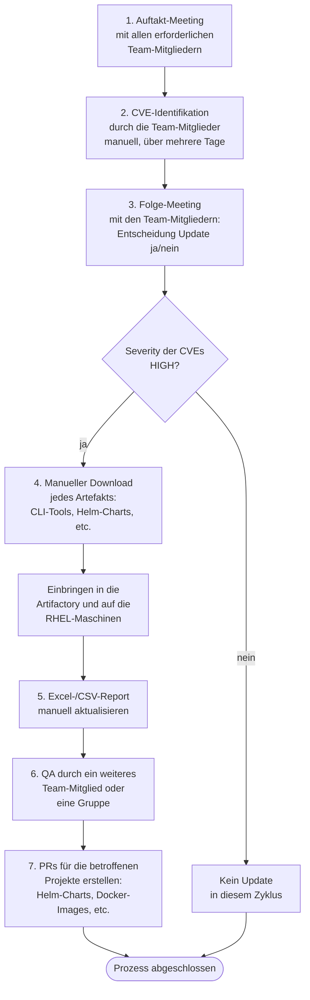

# Ist-Prozess: Update von Drittsoftware (CLI-Tools, Helm-Charts, Pip-Pakete, Images)

**Stand:** 2026-07-23

Dieses Dokument beschreibt den aktuellen Ablauf des Update-Prozesses, wie er heute im Team durchgeführt wird.

---

## Prozessübersicht

---

## Prozessschritte im Detail

### Schritt 1 — Auftakt-Meeting

Der Prozess beginnt mit einem Meeting, zu dem alle erforderlichen Team-Mitglieder eingeladen werden. In diesem Termin wird der anstehende Update-Zyklus besprochen und die Aufgabenverteilung für die CVE-Recherche festgelegt.

### Schritt 2 — CVE-Identifikation

Die Team-Mitglieder identifizieren die relevanten CVEs für die eingesetzten Tools und Komponenten. Dies geschieht manuell über verschiedene Quellen und erstreckt sich über mehrere Tage.

### Schritt 3 — Entscheidungs-Meeting

In einem weiteren Meeting werden die Rechercheergebnisse zusammengetragen. Das Team entscheidet gemeinsam, ob und welche Tools aktualisiert werden sollen.

### Schritt 4 — Beschaffung und Verteilung (bei Severity HIGH)

Ist die Severity der identifizierten CVEs HIGH, wird jedes betroffene Artefakt einzeln manuell heruntergeladen — CLI-Tools, Helm-Charts und weitere Komponenten. Anschließend werden die Artefakte in die JFrog Artifactory eingebracht und auf die RHEL-Maschinen verteilt.

### Schritt 5 — Report-Aktualisierung

Der Excel-/CSV-Report mit den Tool-Versionen wird manuell auf den neuen Stand gebracht.

### Schritt 6 — Qualitätssicherung

Ein weiteres Team-Mitglied oder eine Gruppe von Mitgliedern prüft die durchgeführten Änderungen (QA).

### Schritt 7 — Pull Requests

Für die betroffenen Projekte werden Pull Requests mit den aktualisierten Helm-Charts, Docker-Images und weiteren Anpassungen erstellt.

---

## Beteiligte Systeme und Rollen

| Element | Rolle im Prozess |
|---|---|
| Team-Mitglieder | Recherche, Entscheidung, Download, Verteilung, Report, QA, PRs |
| JFrog Artifactory | Ablage der beschafften Artefakte |
| RHEL-Maschinen | Zielsysteme für die CLI-Tools |
| Excel-/CSV-Report | Dokumentation der Versionsstände |
| Git-Repositories | Zielprojekte der PRs (Helm-Charts, Docker-Images, etc.) |
