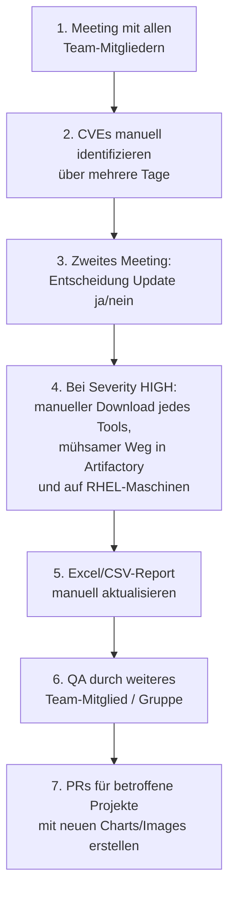
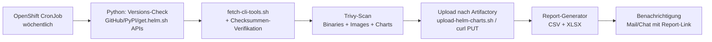
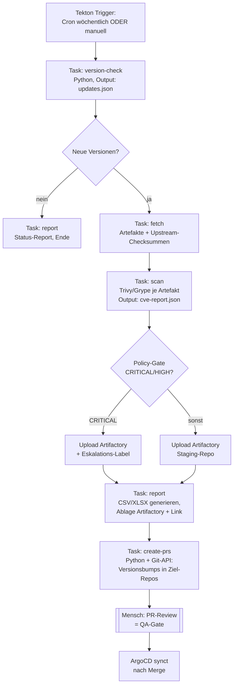
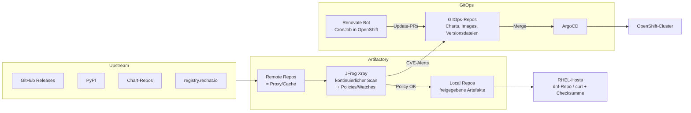

# Konzept: Automatisierung des Tool- und Chart-Update-Prozesses

**Datum:** 2026-07-23
**Autor:** Hakan Yedibela
**Zielgruppe:** Team-Präsentation / Entscheidungsvorlage
**Technologie-Stack des Kunden:** JFrog Artifactory, RHEL, OpenShift, Shell, Python, Tekton, ArgoCD

---

## 1. Ist-Prozess (aktuell, manuell)

Der heutige Update-Prozess für Drittsoftware (CLI-Tools, Helm-Charts, Pip-Pakete, Container-Images) läuft vollständig manuell:

### Schwachstellen des Ist-Prozesses

| # | Schritt | Problem | Kosten |
|---|---|---|---|
| 1 | Kick-off-Meeting | Alle Mitglieder gebunden, bevor überhaupt Fakten vorliegen | Personenstunden ohne Informationsgewinn |
| 2 | Manuelle CVE-Recherche | **Mehrere Tage** Handarbeit; Ergebnis abhängig von Tagesform und Quellenauswahl; nicht reproduzierbar | Langsam, fehleranfällig, lückenhaft |
| 3 | Entscheidungs-Meeting | Entscheidung ohne einheitliche Datenbasis (jeder hat anders recherchiert) | Verzögerung, Diskussion statt Policy |
| 4 | Manueller Download & Transfer | Jedes Artefakt einzeln herunterladen, Checksummen selten geprüft, Upload nach Artifactory und auf RHEL-Hosts sehr mühsam | Höchster Zeitfresser; Supply-Chain-Risiko (keine systematische Verifikation) |
| 5 | Report-Pflege von Hand | Excel wird nachgezogen statt generiert; veraltet sofort | Doppelarbeit, Inkonsistenz zum Ist-Zustand |
| 6 | Manuelle QA | Prüft primär Tippfehler der Schritte 4–5 — Fehlerklassen, die bei Automatisierung gar nicht entstehen | Personenaufwand für vermeidbare Fehler |
| 7 | Manuelle PR-Erstellung | Copy-Paste von Versionsnummern in mehrere Repos | Fehleranfällig, vergessene Repos |

**Kernproblem:** Menschen erledigen Maschinenarbeit (Recherche, Download, Transfer, Reporting), und die eigentliche Menschenarbeit (Risikoabwägung, Freigabe) bekommt keine verlässliche Datenbasis.

---

## 2. Zielbild

> **Maschinen sammeln, prüfen, transportieren und dokumentieren. Menschen entscheiden nur noch an zwei Gates: „Update freigeben?" und „PR mergen?"**

Abbildung der alten Schritte auf Automatisierung:

| Ist-Schritt | Soll |
|---|---|
| 1. Kick-off-Meeting | entfällt — Pipeline läuft zeitgesteuert (Tekton CronJob), Ergebnis liegt vor dem ersten Meeting vor |
| 2. CVE-Recherche (Tage) | **automatischer Scan** (JFrog Xray und/oder Trivy/Grype), Minuten statt Tage, reproduzierbar |
| 3. Entscheidungs-Meeting | **ein** kurzes Review-Meeting mit fertigem, generiertem Report; Policy entscheidet Standardfälle automatisch |
| 4. Manueller Download/Transfer | **Artifactory Remote Repositories** (Proxy/Cache) + Fetch-Pipeline mit Checksummen-Verifikation (`fetch-cli-tools.sh` existiert bereits) |
| 5. Excel/CSV manuell | **Report wird generiert** (Python, CSV/XLSX — Generator existiert bereits) |
| 6. Manuelle QA | Pipeline-Gates: Checksummen, Signaturen, Scan-Policies; menschliche QA nur noch als PR-Review |
| 7. Manuelle PRs | **automatische PRs** (Renovate bzw. Python-Job über Git-API), Mensch merged |

---

## 3. Lösungsbausteine (Stack-bezogen)

| Baustein | Technologie (vorhanden) | Funktion |
|---|---|---|
| **Version-Monitoring** | Renovate Bot (self-hosted, läuft als CronJob in OpenShift) oder Python-Skript | Erkennt neue Releases von CLI-Tools, Charts, Pip-Paketen, Images; öffnet automatisch PRs mit Versionsbump |
| **CVE-Scanning** | **JFrog Xray** (Lizenz prüfen) oder OSS: **Trivy**/**Grype** als Tekton-Task | Scannt alles, was in Artifactory liegt bzw. in der Pipeline gebaut wird; liefert CVE + CVSS-Severity maschinenlesbar (JSON) |
| **Artefakt-Beschaffung** | **Artifactory Remote Repositories** | Artifactory proxied Upstream (get.helm.sh, GitHub Releases, PyPI, registry.redhat.io). Erster Zugriff lädt und cached — der manuelle Download entfällt vollständig |
| **Air-Gap-Transfer** | vorhandene Skripte (`fetch-cli-tools.sh`, `embed-cli.sh`, `upload-helm-charts.sh`) | Für Netze ohne Upstream-Zugriff: checksummen-verifizierter Fetch + Selbstextraktions-Transfer |
| **Pipeline-Orchestrierung** | **Tekton** (in OpenShift) | Cron-getriggerte Pipeline: check → fetch → scan → upload → report → PR |
| **Deployment** | **ArgoCD** | Chart-/Image-Updates landen als PR im GitOps-Repo; nach Merge rollt ArgoCD aus. Optional ArgoCD Image Updater für Image-Tags |
| **Reporting** | Python (openpyxl) | CSV + formatiertes XLSX je Lauf, Ablage in Artifactory (generic repo) oder SharePoint-Upload via MS Graph API |
| **Policy** | Xray Policies / eigenes Python-Gate | z. B. „CRITICAL → Update-PR sofort + Pflicht-Review in 48h; HIGH → nächstes Wartungsfenster; MEDIUM/LOW → Quartals-Sammel-PR" |

---

## 4. Drei Ausbaustufen (Ansätze)

### Ansatz A — „Quick Win" (Skripte + Cron, ca. 1–2 Wochen Aufwand)

Minimale Änderung, sofortiger Effekt. Kein neues Produkt, nur vorhandene Skripte + ein Scheduler.

- **Neu zu bauen:** Versions-Check-Skript (Python, ~200 Zeilen: GitHub Releases API, PyPI JSON API, helm repo index), Trivy-Aufruf, CronJob-Manifest.
- **Vorhanden:** Fetch, Embed, Upload, Report-Generator (dieses Repo).
- **Mensch:** liest Report, entscheidet, führt Updates wie bisher aus — aber auf fertiger Datenbasis.
- **Ergebnis:** Schritte 1–2 und 5 automatisiert. CVE-Recherche von Tagen auf Minuten.

### Ansatz B — „Tekton-Pipeline" (voll integriert in OpenShift, ca. 4–6 Wochen)

Der komplette Fluss als Tekton-Pipeline mit Tasks; jede Stufe versioniert, auditierbar, wiederholbar.

- **Neu zu bauen:** 5–6 Tekton-Tasks (alle dünne Wrapper um vorhandene Shell/Python-Skripte), Policy-Gate (Python: CVSS-Schwellen aus `policy.yaml`), PR-Bot (Python, GitLab/GitHub API).
- **RHEL-Hosts ohne OpenShift:** beziehen die Binaries aus Artifactory (`curl` + Checksumme oder dnf-Repo, s. Ansatz C), statt Handkopie.
- **Ergebnis:** Schritte 1–5 und 7 automatisiert; Schritt 6 (QA) wird zum PR-Review; Meetings schrumpfen auf ein Freigabe-Review.

### Ansatz C — „Vollausbau GitOps + Xray" (Best Practice, ca. 2–3 Monate inkl. Prozessumstellung)

Ansatz B plus konsequente Nutzung der Artifactory-Plattform und Renovate:

Kernpunkte:

1. **Remote Repositories** in Artifactory für alle Upstream-Quellen → niemand lädt mehr manuell; Artefakte kommen ausschließlich über den kontrollierten Proxy (Single Source of Truth, Air-Gap-tauglich per Export/Import zwischen Instanzen).
2. **Xray Watches + Policies**: kontinuierlicher Scan aller gecachten/lokalen Artefakte. Policy-Beispiel: `CRITICAL → Download-Block + Alert`, `HIGH → Alert + Jira-Ticket automatisch`. CVE-Identifikation (alter Schritt 2) läuft damit **permanent**, nicht quartalsweise.
3. **Renovate Bot** überwacht Chart-Versionen, Image-Tags, Pip-Requirements und Versions-Pins in den GitOps-Repos und erstellt automatisch PRs inkl. Changelog-Link (ersetzt Schritte 1, 3, 7).
4. **ArgoCD** deployt nach Merge; App-of-Apps-Pattern für alle Cluster-Addons.
5. **RHEL-Hosts**: Binaries als eigenes generic/dnf-Repo aus Artifactory (`dnf config-manager --add-repo https://artifactory<...>/rhel-tools`), Versionierung über dieselbe Pipeline.
6. **Report**: Xray-API + Renovate-Daten → generierter CSV/XLSX/Confluence-Report je Lauf; SharePoint-Upload optional via MS Graph API.

- **Voraussetzung:** Xray-Lizenz (sonst Trivy-Operator als OSS-Ersatz), Renovate self-hosted (OSS, läuft als CronJob im Cluster).
- **Ergebnis:** Alle 7 Schritte automatisiert; Mensch = Approver an zwei Gates (Policy-Ausnahmen, PR-Merge).

---

## 5. Vergleich der Ansätze

| Kriterium | A: Quick Win | B: Tekton-Pipeline | C: GitOps + Xray |
|---|---|---|---|
| Aufwand initial | ~1–2 Wochen | ~4–6 Wochen | ~2–3 Monate |
| Neue Komponenten | CronJob, Trivy | Tekton-Tasks, PR-Bot | Renovate, Xray-Policies, Remote Repos |
| Lizenzkosten | keine | keine | Xray (optional, sonst OSS-Ersatz) |
| CVE-Erkennung | wöchentlich | je Pipeline-Lauf | **kontinuierlich** |
| Manuelle Restarbeit | Update-Durchführung | PR-Review | PR-Review |
| Auditierbarkeit | Report-Dateien | Pipeline-Läufe + Reports | vollständig (Xray + Git-Historie) |
| Air-Gap-Fähigkeit | über vorhandene Embed-Skripte | dito | Artifactory Export/Import |
| Risiko | gering | gering–mittel | mittel (Prozessumstellung) |

**Empfehlung:** A sofort starten (nutzt fast nur Vorhandenes), parallel B aufsetzen; C als Zielbild fürs nächste Quartal mit Xray-Lizenzentscheidung.

---

## 6. Neuer Prozess aus Team-Sicht (Soll, mit Ansatz B/C)

1. **Montag 06:00** — Pipeline läuft automatisch: Versionen geprüft, Artefakte geholt, gescannt, Report generiert, PRs erstellt.
2. **Montag 10:00, 15 Minuten Review-Meeting** (statt zwei langer Meetings): Team sieht fertigen Report (XLSX/Dashboard) mit CVEs inkl. Severity, Diff der Versionen, Links zu Changelogs. Entscheidung nur für Fälle außerhalb der Policy.
3. **PR-Review = QA**: Zweites Augenpaar prüft den maschinell erstellten PR (Versionen, Scan-Ergebnis verlinkt) — nicht mehr Tippfehler aus Handarbeit.
4. **Merge → ArgoCD rollt aus**; RHEL-Hosts ziehen aus Artifactory.
5. **Report & Audit-Trail** entstehen als Nebenprodukt der Pipeline — niemand pflegt mehr Excel von Hand.

**Zeitersparnis-Schätzung:** CVE-Recherche: Tage → Minuten. Download/Transfer: Stunden je Tool → 0 (Proxy/Pipeline). Meetings: 2 lange → 1 kurzes. Report: manuell → generiert.

---

## 7. Nächste Schritte

- [ ] Entscheidung Ansatz (Empfehlung: A sofort, B beauftragen, C als Roadmap)
- [ ] Klären: Xray-Lizenz vorhanden/geplant?
- [ ] Artifactory: Remote Repos für get.helm.sh, GitHub Releases, PyPI, registry.redhat.io anlegen (Aufwand: Stunden)
- [ ] PoC Renovate self-hosted gegen ein GitOps-Repo
- [ ] Versions-Check-Skript (Python) + Trivy-Task bauen
- [ ] Policy-Definition im Team: Severity-Schwellen → Aktion (CRITICAL/HIGH/MEDIUM/LOW)
- [ ] SharePoint-Anbindung des Reports (MS Graph API) — optional

---

*Referenzen: vorhandene Automatisierungsbausteine in diesem Repo — `scripts/fetch-cli-tools.sh`, `scripts/embed-cli.sh`, `scripts/upload-helm-charts.sh|.ps1|.cmd`, Report-Generator (`docs/report-cli-tools-patchday-2026-07-22.*`); Doku: `scripts/README-cli-tools.md`, `scripts/README-upload-helm-charts.md`.*
