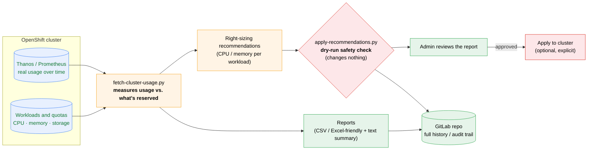
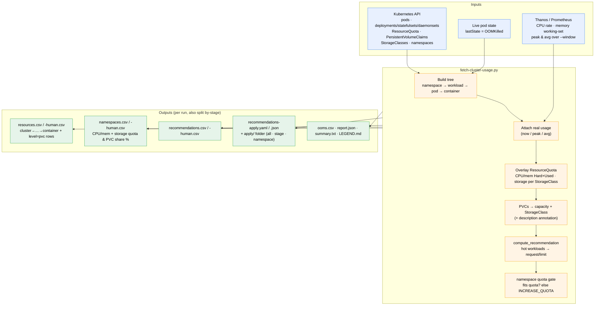
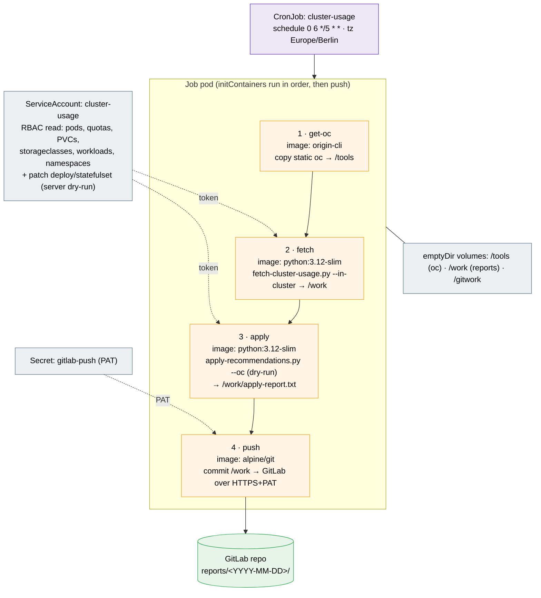
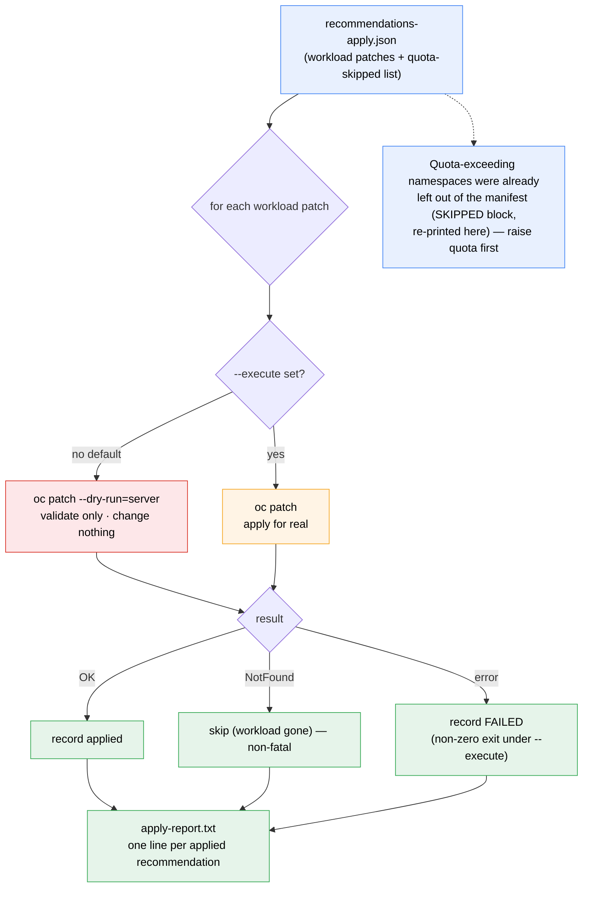
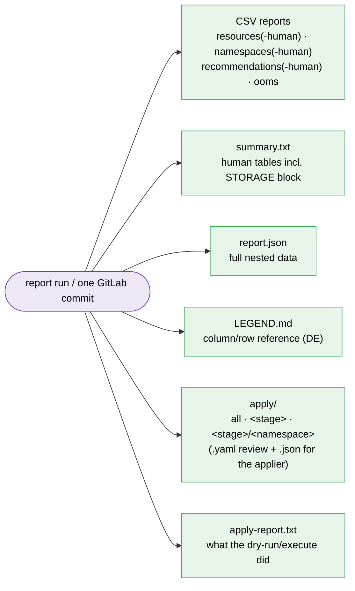

# Cluster Usage & Right-Sizing — Architecture

How `fetch-cluster-usage.py`, `apply-recommendations.py`, and the CronJob work
together to measure real cluster usage, recommend right-sized CPU/memory/storage,
and archive the reports — safely (dry-run by default) and on a schedule.

> **Viewing this:** the diagrams below are [Mermaid](https://mermaid.js.org) and
> render automatically in **GitLab** and **GitHub** markdown and in VS Code
> (Mermaid preview). The doc is split into a one-screen **overview (for
> management)** and **detailed views (for admins)**.
>
> **Slide-ready images:** pre-rendered **PNG** (for PowerPoint/Keynote) and
> **SVG** (crisp at any zoom) of every diagram live in the `docs/diagrams/`
> folder — `01-overview`, `02-data-flow`, `03-cronjob-pipeline`,
> `04-apply-workflow`, `05-output-artifacts`. Regenerate
> them from the `.mmd` sources with the Mermaid CLI
> (`mmdc -i docs/diagrams/<name>.mmd -o docs/diagrams/<name>.png -b white -s 3`).

---

## 1. At a glance (overview)

What the system does, end to end — measure → recommend → review → archive.

**Why it matters**
- **Capacity & cost** — see where CPU/memory/storage are over- or under-provisioned vs. real usage.
- **Right-sizing** — concrete per-workload recommendations, derived from measured peaks.
- **Safe by default** — recommendations are validated against the live cluster but **applied to nothing** unless a human explicitly approves.
- **Audit trail** — every run is committed to GitLab with date-stamped reports.

---

## 2. Data flow — what `fetch-cluster-usage.py` reads and writes (admin)

Stdlib-only Python. Runs **in-cluster** (REST API + ServiceAccount token) or
**locally** (`oc`/`kubectl`).

**Recommendation rule (per hot workload, per resource):** a workload is "hot" when
its peak is unbounded or above the target utilisation (`--target-util`, default
80 %). Then `request = round_up(peak)` and `limit = round_up(peak ÷ target_util)`
(CPU → next 10m, memory → next Mi). Quiet workloads are omitted.

---

## 3. The CronJob pipeline (admin)

Every 5 days (06:00 Europe/Berlin) the job runs four steps in order, then pushes
to GitLab. **No image build, no runtime internet** — a static `oc` is copied
between containers; the scripts come from a ConfigMap.

> The `apply` step is **server-side dry-run** (validates against the live cluster,
> mutates nothing) and is **non-fatal**, so the reports — including any validation
> findings — always reach GitLab. Switching it to real changes is a deliberate
> one-flag edit (`--execute`).

---

## 4. Apply workflow — `apply-recommendations.py` (admin)

Reads the machine-readable `recommendations-apply.json`, patches one workload at a
time via `oc`/`kubectl patch --type=strategic`. **Dry-run unless `--execute`.**

**Apply scopes** — the `apply/` folder lets you choose how much to apply:
`apply/all.json` (everything), `apply/<stage>.json` (one stage), or
`apply/<stage>/<namespace>.json` (a single namespace).

---

## 5. Output artifacts (admin)

One run writes a self-contained bundle (repeated per stage under `by-stage/`):

| Artifact | Audience | Contains |
|---|---|---|
| `summary.txt` | quick human read | per-namespace CPU/mem + **STORAGE** (quota, per-class PVC usage & share, PVC list) |
| `*-human.csv` | spreadsheet | same data, units inline (`200m`, `6.3Mi`, `61%`) — open in Excel |
| `*.csv` | machine | raw numbers for pipelines |
| `recommendations-apply.{yaml,json}` | review / apply | proposed right-sizing patches |
| `report.json` | integrations | full nested tree |

---

## 6. Glossary (for non-specialists)

| Term | Plain meaning |
|---|---|
| **request / limit** | the CPU/memory a workload *reserves* / its *ceiling* |
| **ResourceQuota** | a per-namespace cap on total CPU/memory/storage |
| **PVC** | a disk a workload mounts (PersistentVolumeClaim) |
| **StorageClass** | the type/tier of disk (e.g. `file-silver`) |
| **peak utilisation** | the highest real usage observed over the look-back window |
| **right-sizing** | adjusting requests/limits to match real usage (save waste, avoid OOM) |
| **dry-run** | a validated "what would happen" with **no actual change** |
| **OOMKilled** | a container killed for exceeding its memory limit |
